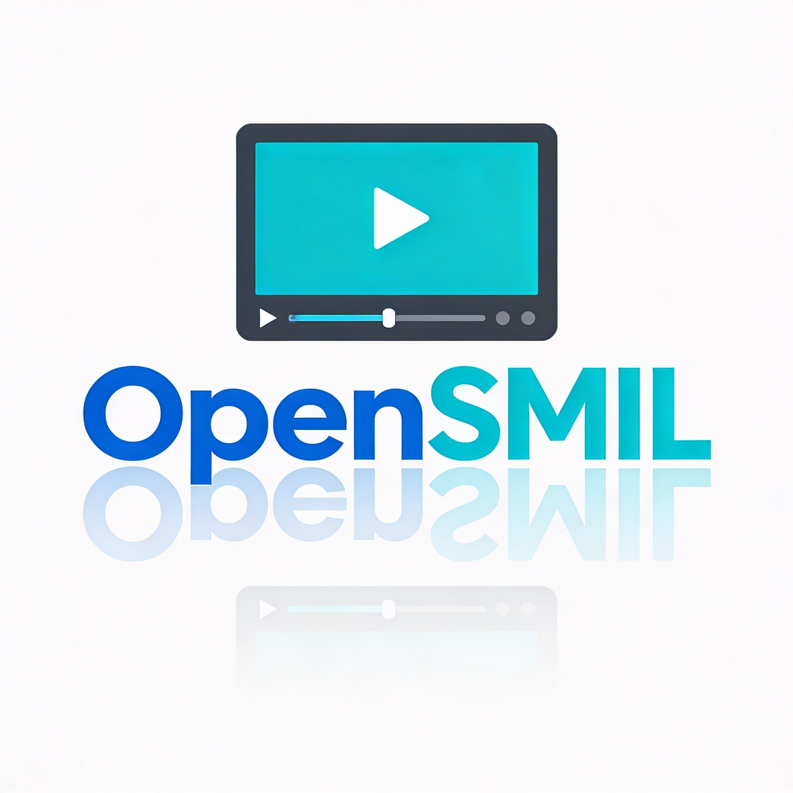

# OpenSMIL Signage


**OpenSMIL Signage** is an open-source, highly scalable Digital Signage backend and management GUI fully compliant with the **SMIL 3.0** standard.

It provides a modern web interface to manage media assets, assemble playlists, and dynamically generate SMIL 3.0 XML files for digital signage players (e.g., BrightSign, IAdea, ViewSonic, or custom a-smil players) to poll and play.

## ✨ Key Features

*   **SMIL 3.0 Generation:** Dynamically translates visual playlist logic into valid SMIL XML (`<seq>`, `<par>`, `<layout>`, `<region>`).
*   **Modern Dashboard:** Sleek Vue.js 3 interface with real-time player status and system health monitoring.
*   **Media Management:** Drag-and-drop uploads for images and videos with automatic metadata extraction.
*   **Playlist Builder:** Advanced content editor to create playback sequences with custom durations.
*   **Multi-Tenancy (IAM):** Role-based access control (Admin/Client) using JWT.
*   **Flexible Storage:** Local filesystem storage (included) or S3-compatible object storage support.

## 🛠️ Tech Stack

### Backend
*   **Framework:** [FastAPI](https://fastapi.tiangolo.com/) (Python)
*   **ORM:** [SQLModel](https://sqlmodel.tiangolo.com/)
*   **Auth:** OAuth2 with JWT
*   **Database:** SQLite (Dev) / MariaDB & PostgreSQL compatible

### Frontend
*   **Framework:** [Vue.js 3](https://vuejs.org/) (Vite + TypeScript)
*   **Styling:** [Tailwind CSS v4](https://tailwindcss.com/)
*   **Icons:** Lucide Vue

## 🚀 Quick Start

### 1. Backend Setup
```bash
# Install dependencies
pip install -r requirements.txt

# Initialize the database and create admin user (Default: admin/admin)
python -m app.initial_data

# Start the server
uvicorn app.main:app --reload
```
The API will be available at `http://localhost:8000`. Docs at `/docs`.

### 2. Frontend Setup
```bash
cd frontend
npm install
npm run dev
```
The GUI will be available at `http://localhost:5173`.

## 📂 Project Structure
```text
OpenSMIL/
├── app/
│   ├── api/          # RESTful endpoints
│   ├── core/         # Security, DB, and Configuration
│   ├── models/       # SQLModel database schemas
│   ├── services/     # SMIL Builder & Storage logic
│   └── static/       # Assets (Logos, etc.)
├── frontend/         # Vue.js 3 Application
├── data/             # SQLite database volume
└── media_local/      # Local storage fallback
```

## 🧪 Verification
You can verify the SMIL generation using the provided script:
```bash
python verify_smil.py
```

## 📄 License
This project is licensed under the MIT License.
